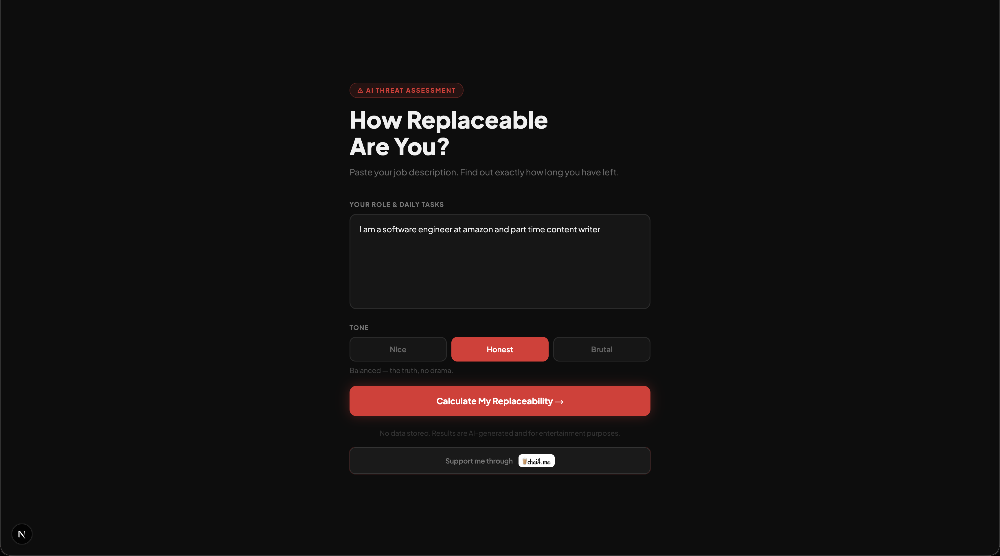
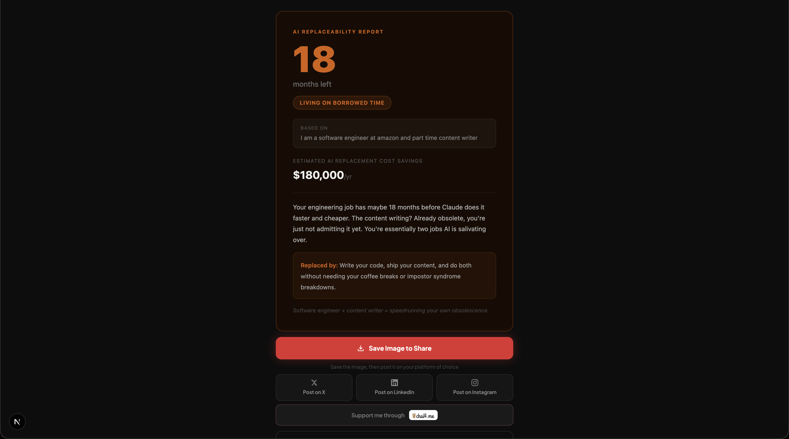

# How Replaceable Are You? ⚠️

> Paste your job description. Find out exactly how long you have left.

An AI-powered roast tool that tells you how replaceable you are — with three levels of mercy: **Nice**, **Honest**, or **Brutal**.

---

## Screenshots
### Home Page

### Result Page

---

## What it does

You describe your role and daily tasks. The AI comes back with:

- **Months until replaced** — a (possibly exaggerated) countdown
- **Annual savings** — what your employer saves by replacing you
- **Risk label** — from *Uniquely Human* to *Already Replaced*
- **The roast** — a punchy, meme-ready verdict on your future

No data stored. Results are AI-generated and for entertainment purposes only.

---

## Stack

- **Next.js** — App Router
- **Anthropic Claude** — claude-haiku-4-5
- **Upstash Redis** — rate limiting
- **Tailwind CSS**
